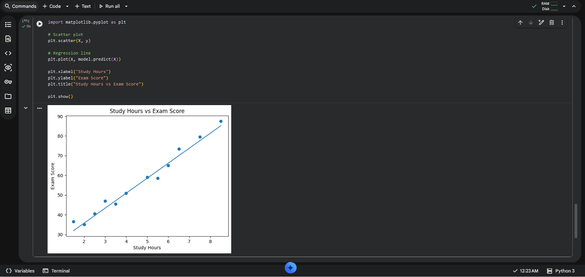

# student-performance-predictor-Linear-regression
# 🎓 Student Performance Predictor using Linear Regression

## 📌 Project Overview
This project predicts a student's exam score based on the number of hours studied using a simple Linear Regression model.

It combines all three tasks:
- Task 1: Data preparation
- Task 2: Model training
- Task 3: Evaluation and prediction

---

## 📊 Dataset
The dataset is manually created and contains two columns:

- **Study_Hours** → Number of hours studied  
- **Exam_Score** → Score obtained in exam  

### Example Data:
| Study Hours | Exam Score |
|------------|-----------|
| 0.5        | 30        |
| 4.5        | 58        |
| 9.5        | 92        |

---

## ⚙️ Technologies Used
- Python 🐍  
- Pandas  
- Scikit-learn  
- Matplotlib  

---

##  Model Used
We used **Linear Regression** to find the relationship between study hours and exam score.

---

## 🔀 Train-Test Split
- Training Data: 80%  
- Testing Data: 20%  

---

## 📈 Model Evaluation
The model is evaluated using:

### ➤ Mean Absolute Error (MAE)
MAE measures the average difference between actual and predicted values.

✔️ **MAE obtained:** ~2 (very low error)

---

## 🔮 Prediction Example

For a student who studies **4.5 hours**:
Predicted Score: 58.5

## 📊 Visualization

The graph below shows the relationship between study hours and exam score.

- Blue dots represent actual data points  
- The line represents the Linear Regression model prediction  

